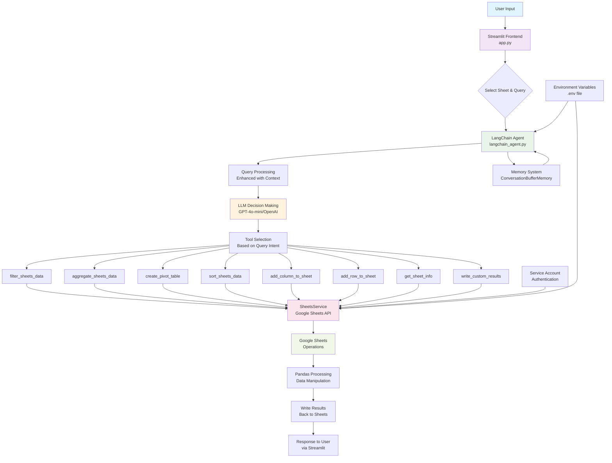

# 🤖 Excel Sheets Agent - Architecture & Flow Documentation

## 📋 Table of Contents
1. [Overview](#overview)
2. [System Architecture](#system-architecture)
3. [Application Flow](#application-flow)
4. [Technical Implementation](#technical-implementation)
5. [Component Details](#component-details)
6. [Workflow Examples](#workflow-examples)
7. [Security & Configuration](#security--configuration)
8. [API Reference](#api-reference)

## 🔍 Overview

The Excel Sheets Agent is a sophisticated AI-powered application that enables natural language interaction with Google Sheets. Built with LangChain, OpenAI GPT-4o-mini, and Streamlit, it provides an intelligent interface for complex spreadsheet operations without requiring technical expertise.

### Key Capabilities
- Natural language query processing
- Advanced data filtering and aggregation
- Pivot table creation and analysis
- Data sorting and manipulation
- Column and row management
- Conversation memory and context awareness
- Multi-step operation execution

## 🏗️ System Architecture

The application follows a **3-tier architecture**:

### Architecture Diagram


https://www.mermaidchart.com/
copy code on site to see diagram

### Architecture Layers

#### 1. **Frontend Layer** (`app.py`)
- **Technology**: Streamlit web framework
- **Purpose**: User interface and interaction management
- **Features**: Sheet selection, query input, result display, memory management

#### 2. **Agent Layer** (`langchain_agent.py`)
- **Technology**: LangChain + OpenAI GPT-4o-mini
- **Purpose**: AI orchestration and decision making
- **Features**: Natural language processing, tool selection, memory management

#### 3. **Tool Layer** (`langchain_tools.py`)
- **Technology**: Google Sheets API + Pandas
- **Purpose**: Data operations and manipulation
- **Features**: CRUD operations, data analysis, result generation

## 🔄 Application Flow

### High-Level Flow Process

1. **User Interaction**
   - User selects a Google Sheet from dropdown
   - User enters natural language query
   - Optional: User selects from example queries

2. **Query Processing**
   - Streamlit captures user input
   - Query sent to LangChain agent with sheet context
   - Agent enhances query with current sheet information

3. **AI Decision Making**
   - LLM analyzes query intent and requirements
   - Agent selects appropriate tools for execution
   - Multi-step planning for complex operations

4. **Tool Execution**
   - Selected tools perform Google Sheets operations
   - Data processing using pandas for complex manipulations
   - Results written back to sheets (new or existing)

5. **Response Generation**
   - Agent compiles execution results
   - Formatted response sent back to user
   - Conversation memory updated for context

### Detailed Flow Breakdown

#### Step 1: User Interface Initialization
```python
# app.py - Sheet selection and UI setup
sheet_names = get_sheet_names()
sheet = st.selectbox("📋 Select Worksheet", sheet_names)
user_query = st.text_area("✨ Your Query:", height=100)
```

#### Step 2: Agent Orchestration
```python
# langchain_agent.py - Query processing
def process_query(self, user_query: str, sheet_name: str = None):
    # Set current sheet context
    self.set_current_sheet(sheet_name)
    
    # Enhance query with context
    enhanced_query = f"""
    Sheet: {self.current_sheet}
    User Request: {user_query}
    """
    
    # Execute via LangChain agent
    response = self.agent_executor.invoke({"input": enhanced_query})
```

#### Step 3: Tool Selection and Execution
```python
# langchain_tools.py - Tool execution based on intent
@tool(args_schema=FilterDataInput)
def filter_sheets_data(condition: str, target_sheet: Optional[str] = None):
    # Read current sheet data
    df = sheets_service.read_sheet(current_sheet)
    
    # Apply filter condition
    filtered_df = df.query(condition)
    
    # Write results to target sheet
    result = sheets_service.write_to_sheet(filtered_df, target_sheet)
```

## 🔧 Technical Implementation

### Core Technologies

| Component | Technology | Purpose |
|-----------|------------|---------|
| **Frontend** | Streamlit | Web interface and user interaction |
| **AI Engine** | LangChain + OpenAI GPT-4o-mini | Natural language processing and decision making |
| **Data Processing** | Pandas | Data manipulation and analysis |
| **Google Sheets** | Google Sheets API v4 | Spreadsheet operations |
| **Authentication** | Google Service Account | Secure API access |
| **Memory** | ConversationBufferMemory | Context and conversation history |

### LangChain Agent Implementation

#### Agent Configuration
```python
class LangChainSheetsAgent:
    def __init__(self):
        self.llm = self._initialize_llm()  # GPT-4o-mini
        self.memory = self._initialize_memory()  # Conversation buffer
        self.tools = SHEETS_TOOLS  # 8 specialized tools
        self.agent_executor = self._create_agent_executor()
```

#### Tool Calling System
```python
# Create agent with tool calling capability
agent = create_tool_calling_agent(
    llm=self.llm,
    tools=self.tools, 
    prompt=prompt
)

# Agent executor with memory and error handling
return AgentExecutor(
    agent=agent,
    tools=self.tools,
    memory=self.memory,
    verbose=True,
    handle_parsing_errors=True,
    max_iterations=5
)
```

### Google Sheets Integration

#### Service Account Authentication
```python
credentials = service_account.Credentials.from_service_account_file(
    'service_account.json', scopes=SCOPES
)
service = build('sheets', 'v4', credentials=credentials)
```

#### Data Operations Pipeline
1. **Read**: `service.spreadsheets().values().get()`
2. **Process**: Pandas DataFrame operations
3. **Write**: `service.spreadsheets().values().update()`

## 📊 Component Details

### Available Tools Overview

| Tool Name | Purpose | Input Parameters | Output |
|-----------|---------|------------------|--------|
| `filter_sheets_data` | Filter data based on conditions | `condition`, `target_sheet` | Filtered dataset in new sheet |
| `aggregate_sheets_data` | Group and summarize data | `group_by`, `agg_column`, `agg_method` | Aggregated results |
| `create_pivot_table` | Multi-dimensional analysis | `index_col`, `columns_col`, `values_col` | Pivot table |
| `sort_sheets_data` | Sort data by column | `sort_column`, `ascending` | Sorted dataset |
| `add_column_to_sheet` | Add calculated columns | `column_name`, `formula`, `default_value` | Sheet with new column |
| `add_row_to_sheet` | Insert new records | `row_data`, `position` | Sheet with new row |
| `get_sheet_info` | Retrieve sheet metadata | None | Column names, sample data, row count |
| `write_custom_results` | Custom result output | `data`, `sheet_name`, `start_cell` | Results written to specified location |

### Tool Implementation Examples

#### Data Filtering Tool
```python
@tool(args_schema=FilterDataInput)
def filter_sheets_data(condition: str, target_sheet: Optional[str] = None) -> str:
    """
    Filter Google Sheets data based on conditions.
    
    Examples:
    - 'salary > 50000'
    - 'name == "John"'
    - 'salary > 50000 and age < 40'
    """
    df = sheets_service.read_sheet(current_sheet)
    filtered_df = df.query(condition)
    result = sheets_service.write_to_sheet(filtered_df, target_sheet)
    return f"Filtered {len(filtered_df)} rows to '{target_sheet}'"
```

#### Aggregation Tool
```python
@tool(args_schema=AggregateDataInput)
def aggregate_sheets_data(group_by: str, agg_column: str, agg_method: str, target_sheet: Optional[str] = None) -> str:
    """
    Aggregate data by grouping and summarizing columns.
    
    Available methods: sum, mean, count, min, max
    """
    df = sheets_service.read_sheet(current_sheet)
    
    if agg_method.lower() == 'count':
        result = df.groupby(group_by).size().reset_index(name='count')
    else:
        result = df.groupby(group_by)[agg_column].agg(agg_method).reset_index()
    
    write_result = sheets_service.write_to_sheet(result, target_sheet)
    return f"Aggregated data by '{group_by}' using {agg_method} method"
```

### Memory Management

#### Conversation Context
```python
def set_current_sheet(self, sheet_name: str):
    """Set current sheet and update context"""
    self.current_sheet = sheet_name
    
    # Load sheet context
    df = sheets_service.read_sheet(sheet_name)
    columns = list(df.columns)
    sample_data = df.head(2).to_dict('records')
    
    # Add to conversation memory
    context_msg = f"""
    Current Sheet Context Updated:
    - Sheet: {sheet_name}
    - Columns: {columns}
    - Sample Data: {sample_data}
    - Total Rows: {len(df)}
    """
    self.memory.chat_memory.add_message(SystemMessage(content=context_msg))
```

## 🎯 Workflow Examples

### Example 1: Data Filtering Operation

**User Query**: "Show me employees with salary greater than 50000"

**System Flow**:
1. **Parse Intent**: Filter operation identified
2. **Tool Selection**: `filter_sheets_data` chosen
3. **Parameter Extraction**: `condition='salary > 50000'`
4. **Execution**: 
   ```python
   df = read_sheet('employees')
   filtered_df = df.query('salary > 50000')
   write_to_sheet(filtered_df, 'employees_filtered')
   ```
5. **Response**: "Filtered 25 employees with salary > 50000 to 'employees_filtered' sheet"

### Example 2: Complex Multi-Step Operation

**User Query**: "Filter employees with salary > 50000 and create a summary by department"

**System Flow**:
1. **Parse Intent**: Filter + Aggregation operations
2. **Multi-Step Planning**:
   - Step 1: Filter data
   - Step 2: Aggregate filtered results
3. **Tool Execution**:
   ```python
   # Step 1: Filter
   filter_sheets_data(condition='salary > 50000', target_sheet='high_earners')
   
   # Step 2: Aggregate
   aggregate_sheets_data(
       group_by='department', 
       agg_column='salary', 
       agg_method='sum',
       target_sheet='department_summary'
   )
   ```
4. **Response**: "Created filtered dataset with 25 employees and department summary showing total compensation by department"

### Example 3: Pivot Table Creation

**User Query**: "Create a pivot table showing sales by region and product category"

**System Flow**:
1. **Parse Intent**: Pivot table operation
2. **Tool Selection**: `create_pivot_table`
3. **Parameter Mapping**:
   - `index_col='region'`
   - `columns_col='product_category'`
   - `values_col='sales'`
   - `agg_func='sum'`
4. **Execution**: Create multi-dimensional analysis
5. **Response**: "Created pivot table with regions as rows and product categories as columns in 'sales_pivot' sheet"

## 🔒 Security & Configuration

### Authentication Setup

#### Google Service Account
1. Create service account in Google Cloud Console
2. Enable Google Sheets API
3. Download JSON credentials file
4. Grant sheet access to service account email

#### Environment Configuration
```env
# .env file
OPENAI_API_KEY=your_openai_api_key_here
SHEET_ID=your_google_sheet_id_here
```

### Security Best Practices

#### Data Protection
- **Service Account**: Limited scope access to specific sheets
- **Environment Variables**: Sensitive data stored securely
- **API Rate Limiting**: Built-in protection against abuse
- **Error Sanitization**: No sensitive data in error messages

#### Access Control
- **Sheet Permissions**: Managed through Google Sheets sharing
- **Service Account Scope**: Limited to sheets API only
- **Authentication**: OAuth2 with service account credentials

### File Structure Security
```
excel-sheets-agent/
├── agents/                    # Core agent logic
├── .env                      # Environment variables (gitignored)
├── service_account.json      # Google credentials (gitignored)
├── app.py                    # Public web interface
├── requirements.txt          # Dependencies
└── .gitignore               # Security exclusions
```

## 📚 API Reference

### LangChainSheetsAgent Methods

#### Core Methods
```python
class LangChainSheetsAgent:
    def process_query(self, user_query: str, sheet_name: str = None) -> Dict[str, Any]
    def set_current_sheet(self, sheet_name: str) -> None
    def get_conversation_history(self) -> list
    def clear_memory(self) -> None
    def get_available_tools(self) -> list
```

#### Response Format
```python
{
    "success": bool,
    "response": str,
    "sheet_name": str,
    "intermediate_steps": list,
    "error": str  # Only if success=False
}
```

### SheetsService Methods

#### Core Operations
```python
class SheetsService:
    def read_sheet(self, sheet_name: str) -> pd.DataFrame
    def create_sheet(self, sheet_name: str) -> bool
    def write_to_sheet(self, df: pd.DataFrame, sheet_name: str, start_cell: str = "A1") -> str
```

### Tool Schemas

#### Filter Data Input
```python
class FilterDataInput(BaseModel):
    condition: str = Field(description="Pandas query condition")
    target_sheet: Optional[str] = Field(default=None, description="Target sheet name")
```

#### Aggregate Data Input
```python
class AggregateDataInput(BaseModel):
    group_by: str = Field(description="Column to group by")
    agg_column: str = Field(description="Column to aggregate")
    agg_method: str = Field(description="Aggregation method: sum, mean, count, min, max")
    target_sheet: Optional[str] = Field(default=None, description="Target sheet name")
```

## 🚀 Performance & Optimization

### Performance Characteristics
- **Response Time**: 2-5 seconds for simple operations
- **Complex Operations**: 5-15 seconds for multi-step processes
- **Memory Usage**: Conversation buffer maintains last 50 messages
- **API Efficiency**: Batched operations where possible

### Optimization Features
- **Pandas Integration**: Efficient data processing
- **Lazy Loading**: Sheets loaded only when needed
- **Error Recovery**: Automatic retry for transient failures
- **Context Caching**: Sheet metadata cached during session

## 🔧 Troubleshooting

### Common Issues and Solutions

#### Authentication Errors
```
Error: Unable to authenticate with Google Sheets API
Solution: Check service_account.json file and ensure service account has sheet access
```

#### Tool Execution Errors
```
Error: Column 'salary' not found
Solution: Use get_sheet_info tool to verify available columns
```

#### Memory Issues
```
Error: Agent memory full
Solution: Use clear_memory() function in sidebar to reset conversation history
```

### Debug Mode
Enable verbose logging by setting `verbose=True` in agent executor configuration for detailed operation tracking.

---

## 📝 Conclusion

The Excel Sheets Agent represents a sophisticated integration of modern AI technologies to create an intuitive, powerful interface for spreadsheet operations. By combining LangChain's agent framework, OpenAI's language models, and Google's Sheets API, it transforms complex data operations into simple conversational interactions.

The architecture's modular design ensures scalability, maintainability, and extensibility, making it suitable for both individual use and enterprise deployments. The comprehensive tool set covers the majority of common spreadsheet operations while maintaining the flexibility to handle complex, multi-step workflows.

**Built with**: LangChain, OpenAI GPT-4o-mini, Streamlit, Google Sheets API, and Pandas

*Last Updated: [Current Date]* 